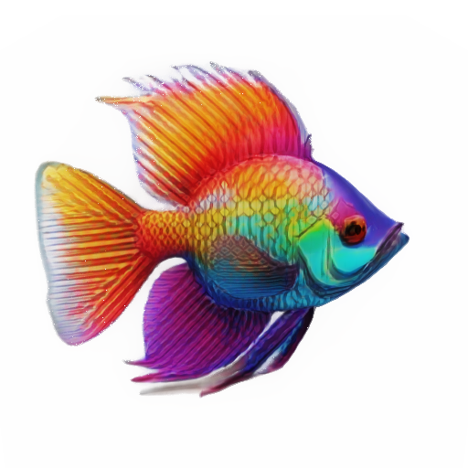
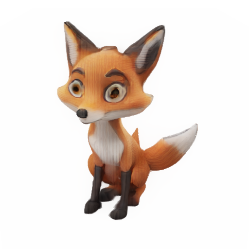
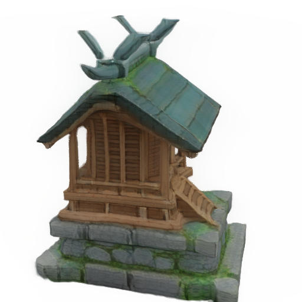
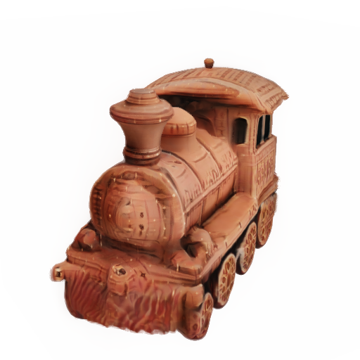
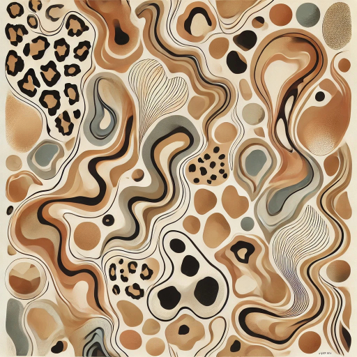
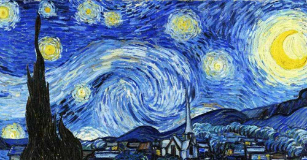

# 3D Stylization via Large Reconstruction Model

    
    <a href="https://ipekoztas.github.io/">İpek Öztaş</a>1,
    
    <a href="https://www.duygu-ceylan.com/">Duygu Ceylan</a>2,
    
    
    <a href="http://www.cs.bilkent.edu.tr/~adundar/">Aysegul Dundar</a>1
    

  1Bilkent University,&nbsp;&nbsp;
  2Adobe Research&nbsp;&nbsp;

## Abstract

With the growing success of text or image guided 3D generators, users demand more control over the generation process, appearance stylization being one of them. Given a reference image, this requires adapting the appearance of a generated 3D asset to reflect the visual style of the reference while maintaining visual consistency from multiple viewpoints. To tackle this problem, we draw inspiration from the success of 2D stylization methods that leverage the attention mechanisms in large image generation models to capture and transfer visual style. In particular, we probe if large reconstruction models, commonly used in the context of 3D generation, has a similar capability. We discover that the certain attention blocks in these models capture the appearance specific features. By injecting features from a visual style image to such blocks, we develop a simple yet effective 3D appearance stylization method. 
Our method does not require training or test time optimization. Through both quantitative and qualitative evaluations, we demonstrate that our approach achieves superior results in terms of 3D appearance stylization, significantly improving efficiency while maintaining high-quality visual outcomes.

## Results
<table>
    <tr>
        <td></td>
        <td></td>
        <td></td>
        <td></td>
        <td></td>
    </tr>
    <tr>
        <td></td>
        <td></td>
        <td></td>
        <td></td>
        <td></td>
    </tr>
    <tr>
        <td></td>
        <td></td>
        <td></td>
        <td></td>
        <td></td>
    </tr>
    <tr>
        <td></td>
        <td></td>
        <td></td>
        <td></td>
        <td></td>
    </tr>
</table>
We introduce the use of large pre-trained reconstruction
models for 3D stylization, providing a novel approach to
transferring artistic styles to 3D objects.
Our framework achieves 3D stylization without the need for
training or test-time optimization. This makes our approach
practical for interactive applications.
