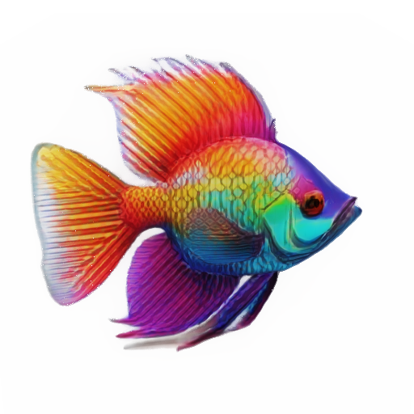
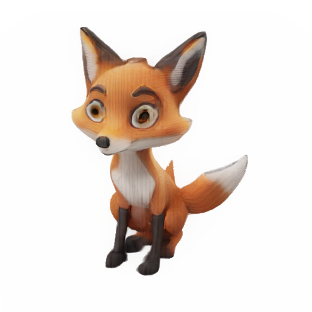
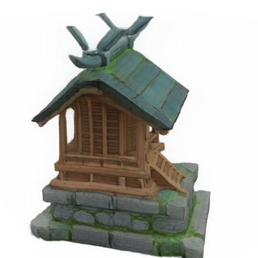
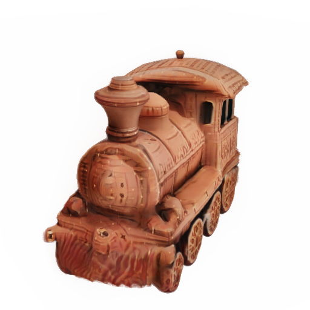
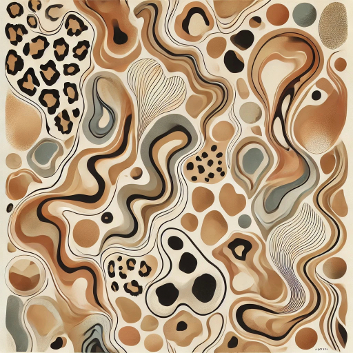
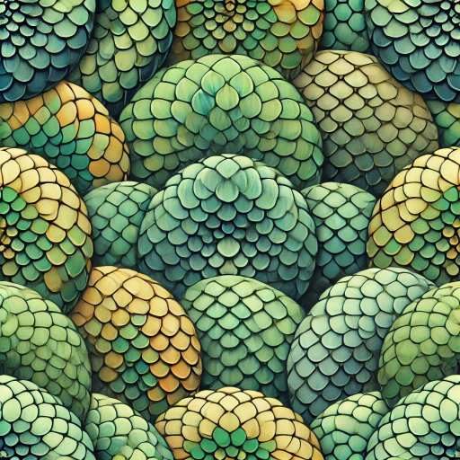
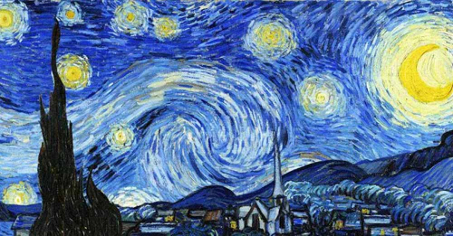

# 3D Stylization via Large Reconstruction Model

<div class="is-size-5 publication-authors">
    <span class="author-block">
    <a href="https://ipekoztas.github.io/">İpek Öztaş</a><sup>1</sup>,</span>
    <span class="author-block">
    <a href="https://www.duygu-ceylan.com/">Duygu Ceylan</a><sup>2</sup>,
    </span>
    <span class="author-block">
    <a href="http://www.cs.bilkent.edu.tr/~adundar/">Aysegul Dundar</a><sup>1</sup>
    </span>
</div>

<div class="is-size-5 publication-authors">
  <span class="author-block"><sup>1</sup>Bilkent University,&nbsp;&nbsp;</span>
  <span class="author-block"><sup>2</sup>Adobe Research&nbsp;&nbsp;</span>
</div>

<a href="https://arxiv.org/abs/2504.21836"></a>
<a href="https://ipekoztas.github.io/3DStylizationLRM/"></a>

## Abstract

With the growing success of text or image guided 3D generators, users demand more control over the generation process, appearance stylization being one of them. Given a reference image, this requires adapting the appearance of a generated 3D asset to reflect the visual style of the reference while maintaining visual consistency from multiple viewpoints. To tackle this problem, we draw inspiration from the success of 2D stylization methods that leverage the attention mechanisms in large image generation models to capture and transfer visual style. In particular, we probe if large reconstruction models, commonly used in the context of 3D generation, has a similar capability. We discover that the certain attention blocks in these models capture the appearance specific features. By injecting features from a visual style image to such blocks, we develop a simple yet effective 3D appearance stylization method. 
Our method does not require training or test time optimization. Through both quantitative and qualitative evaluations, we demonstrate that our approach achieves superior results in terms of 3D appearance stylization, significantly improving efficiency while maintaining high-quality visual outcomes.

## Results
<table>
    <tr>
        <td></td>
        <td></td>
        <td></td>
        <td></td>
        <td></td>
    </tr>
    <tr>
        <td></td>
        <td></td>
        <td></td>
        <td></td>
        <td></td>
    </tr>
    <tr>
        <td></td>
        <td></td>
        <td></td>
        <td></td>
        <td></td>
    </tr>
    <tr>
        <td></td>
        <td></td>
        <td></td>
        <td></td>
        <td></td>
    </tr>
</table>

We introduce a novel approach for 3D stylization by injecting style features into a large pre-trained 3D reconstruction model.  
**Note:** The baseline 3D reconstruction is performed by [InstantMesh](https://github.com/TencentARC/InstantMesh).  
Our contribution is the style transfer mechanism, which enables artistic appearance transfer to 3D objects without training or test-time optimization.

# InstantMesh + Style Transfer

A toolkit for 3D stylization via large reconstruction models.  
**Baseline 3D reconstruction is provided by [InstantMesh](https://github.com/TencentARC/InstantMesh).**  
**Our work adds style transfer via transformer-based feature injection.**

---

## 🚩 Features

- [x] Release inference code
- [ ] Release HuggingFace Gradio demo

---

## ⚙️ Installation

**Recommended:** Python >= 3.10, PyTorch >= 2.1.0, CUDA >= 12.1

```bash
conda create --name instantmesh python=3.10
conda activate instantmesh
pip install -U pip

# Install Ninja
conda install Ninja

# Install CUDA 12.1
conda install cuda -c nvidia/label/cuda-12.1.0

# Install PyTorch and xformers
pip install torch==2.1.0 torchvision==0.16.0 torchaudio==2.1.0 --index-url https://download.pytorch.org/whl/cu121
pip install xformers==0.0.22.post7

# Install other requirements
pip install -r requirements.txt
```

---

## Usage

### 1. Download Models

We use the original [InstantMesh](https://github.com/TencentARC/InstantMesh) models for 3D reconstruction.  
Our method adds style transfer by injecting features from a style image into the transformer layers of the reconstruction pipeline.

- The inference script downloads models automatically.
- Or, manually place models in the `ckpts/` directory.

_Default:_ Uses the `instant-mesh-large` reconstruction model from InstantMesh.

---

### 2. Generate 3D Meshes from Images

**Baseline 3D reconstruction (InstantMesh):**
```bash
python run.py <config.yaml> <input_image_or_dir>
```

**With our style transfer:**
```bash
python run.py <config.yaml> <input_image_or_dir> --save_video --style <style_image_or_dir> --alpha 0.7 --style_layers 4
```
- `--style`: Path to a style image or directory. This image is used to inject style into the transformer.
- `--alpha`: Alpha blending weight for style injection (default: 0.7).
- `--style_layers`: Number of transformer layers to inject style into (default: 4).

**Examples:**

Baseline mesh from an image (InstantMesh only):
```bash
python run.py configs/instant-mesh-large.yaml examples/genshin_building.png
```

Mesh with our style transfer:
```bash
python run.py configs/instant-mesh-large.yaml examples/genshin_building.png --save_video --style styles/starry_night.jpg --alpha 0.7 --style_layers 4
```

---

## 📚 Citation

If you use this work, please cite:

```BibTeX
@article{oztas20253dstylizationlargereconstruction,
    title={3D Stylization via Large Reconstruction Model}, 
    author={Ipek Oztas and Duygu Ceylan and Aysegul Dundar},
    journal={https://arxiv.org/abs/2504.21836},
    year={2025}
}
```

---

## Acknowledgements

- [InstantMesh](https://github.com/TencentARC/InstantMesh)
- [Zero123++](https://github.com/SUDO-AI-3D/zero123plus)
- [OpenLRM](https://github.com/3DTopia/OpenLRM)
- [FlexiCubes](https://github.com/nv-tlabs/FlexiCubes)
- [Instant3D](https://instant-3d.github.io/)

